# How Concat works, and where it stands

A map of the engine and the window for someone who wants to change one
part without reading the rest, written against the tree at `7223d64`
(11 October 2026, 71 commits past the 0.2.6 tag). Every section names the
crate and the file to open when the picture is not enough; the last
section says what is known to be unfinished or wrong today, with the
audit that says so in detail. Diagrams are Mermaid, which GitHub renders.

Concat is a video editor in Rust. The engine is a set of crates with no
window in them; the window is a Slint application over that engine; a
command-line tool and a socket server drive the same engine through the
same API. One document format, one command set, one renderer, three ways
in. Nothing is spawned at run time: FFmpeg is linked, whisper.cpp and
sherpa-onnx are compiled in, ONNX Runtime is loaded for the models.

## 0. The tree in numbers

| | |
|---|---:|
| Crates in the workspace (`src/crates/`) | 16 |
| Rust | 91 697 lines |
| Slint (the window's `ui/`) | 29 790 lines in 65 files |
| WGSL (effect packages) | 1 764 lines |
| Java (the Android bridge) | 291 lines |
| Effect packages, built in | 123 (98 on format 2 with a shader; 25 sound packages on FFmpeg chains) |
| Locales | 14, 1 016 keys each, 0 missing |
| Downloadable models | 23, every one with a SHA-256, mirrored on the `models-v1` release |
| Tests (`#[test]`) | 719 in 93 files |
| `unsafe` sites | 68, all in FFmpeg, JNI, Wayland, mmap and platform calls |
| Largest file | `concat/src/studio.rs`, 10 689 lines |
| Toolchain | Rust 1.93, pinned in `src/rust-toolchain.toml`; Slint 1.18.1; wgpu 30; FFmpeg 7+ through ffmpeg-the-third 6 |

## 1. The crates and who depends on whom

Every arrow points one way. Nothing below the window knows a window
exists; nothing but `concat-media` knows FFmpeg exists; `concat-core` has
no dependencies at all. The edges are the `[dependencies]` tables of the
manifests, not a wish.

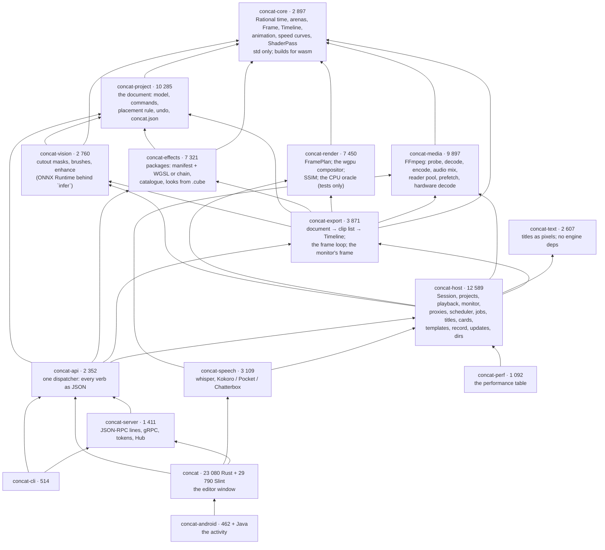

Three things the graph says that matter when adding code:

- **`concat-render` does not know what an effect package is.** It takes a
  `concat_core::ShaderPass` (compiled source, laid-out uniform bytes) and
  draws it. The catalogue in `concat-effects` makes those; `concat-export`
  is where the two meet (`shader_passes_at`).
- **`concat-text` is an island**: fonts, shaping and painting with no
  engine type in its signature. `concat-host/src/titles.rs` is the seam
  that turns a title into an image clip for the rest of the pipeline.
- **The window depends on `concat-api`**, not to drive itself through it
  (it has its own `Session`), but for the Remote page, which embeds a
  server, and for the register of open project folders the two share.

The crates that carry no native library, `concat-core`, `concat-project`,
`concat-effects`, `concat-render` and `concat-text`, build for
`wasm32-unknown-unknown`, and CI keeps them building.

## 2. From the document to a pixel

A clip exists in three shapes on its way to the screen, and each crossing
is one function in one file.

```mermaid
flowchart LR
    doc["Project<br/>concat-project::model<br/>f64 seconds, string ids,<br/>keys as fractions of the clip"]
    flat["Vec&lt;ExportClip&gt;<br/>concat-export::flatten<br/>one list, tracks by index,<br/>titles rejoined as stills"]
    tl["core::Timeline<br/>concat-export::resolve<br/>Rational time, arena ids,<br/>quantised to the frame grid,<br/>sizes, chains, passes, masks decided"]
    plan["FramePlan<br/>concat-render::plan_frame(t)<br/>what is on screen at t: media,<br/>source time, placement, opacity,<br/>blend, per layer, bottom first"]
    filled["FramePlan, filled<br/>concat-export<br/>+ decoded picture, effects resolved<br/>for t, mask, transitions, treatments"]
    gpu["WgpuCompositor<br/>concat-render::gpu<br/>the GPU, or WARP / lavapipe"]
    enc["Encoder<br/>concat-media::encode"]
    tex["a texture on the<br/>window's device"]

    doc -- "flatten_timeline" --> flat
    flat -- "build_timeline" --> tl
    tl -- "plan_frame(t)" --> plan
    plan -- "decode + passes_at" --> filled
    filled --> gpu
    gpu -- "composite: read back" --> enc
    gpu -- "composite_texture: stays on the GPU" --> tex
```

- **The document** (`concat-project/src/model.rs`) is what a person edits
  and what is saved. Times are `f64` seconds, ids are strings, every
  keyframe is a fraction of its clip's length, and serde names are
  camelCase because that is the file's spelling. Every change is a
  `Command` (`commands/`), and `Clip::tidy` is the one place clamps live:
  every time field is held to `MAX_TIME` (a hundred hours), every size to
  `concat_core::frame::MAX_SIDE` (8 192) through `VideoSettings::is_sane`.
- **Placement is a model rule** (`placement.rs`): no clip ever covers
  another on its lane. Every command that places, moves or lengthens a
  clip asks it, and so does the window's drag, so the echo under the
  pointer shows where the drop will land.
- **Flatten and resolve** (`concat-export/src/flatten.rs`, `resolve.rs`)
  turn the document into the engine's `Timeline`: rational time quantised
  to the frame grid so equality is exact, plus the per-clip facts the model
  has no field for (decode sizes, filter chains, shader passes, cutout
  masks, layer treatments). `render` and the preview read what `resolve`
  built and never look at an `ExportClip` again.
- **The plan** (`concat-render/src/plan.rs`) is pure: no files, no pixels.
  Geometry (crop, flips, fit, centre, scale, turn) and weighing (fades
  folded into a scale and offset, wipes into edges, mask, opacity) are
  computed once here, so no backend can drift on them. The export fills
  the plan with the decoded picture, the effects resolved for that instant
  and the treatments live over the stack, and hands it to a compositor,
  which takes a `FramePlan` and nothing else.
- **One compositor.** `WgpuCompositor` draws every frame, the monitor's
  and the export's; a machine without a GPU runs it on the platform's
  software adapter (WARP on Windows, lavapipe on Linux), and a machine
  with neither is told so. The CPU compositor that was the reference is
  kept in the tests alone (`concat-render/src/reference.rs`) as the oracle
  the parity suite (`gpu/tests.rs`) holds the GPU's geometry, masks,
  transitions and blending to, at a structural similarity above 0.99
  (`metrics.rs`). Every device, the compositor's own and the window's,
  carries an uncaptured-error handler that logs, so a driver error no scope
  caught is a wrong frame and a line in the log, never a dead thread.

### 2.1 Colour

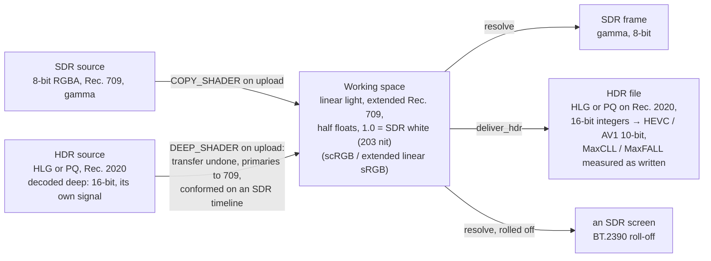

Blending, opacity and fades happen in light, as in Resolve and Final Cut.
A Rec. 2020 source is decoded deep (`DecodeOptions::deep`: sixteen bits a
channel, no CPU tone map) wherever its frame goes straight to the GPU. A
timeline has a colour it is output in (`VideoSettings::color_space`: SDR,
HLG or PQ); `Editor::follow_first_hdr` turns an SDR timeline HLG when a
command puts its first HDR clip on it, in that command's undo step. A clip
with a cutout keeps the eight-bit tone map in the decoder. (`gpu.rs`,
`COPY_SHADER`, `DEEP_SHADER`, `FramePlan::output`, `Compositor::deliver_hdr`,
`Encoder::create_hdr`.)

## 3. Effects

An effect is a folder under `concat-effects/packages/`: `effect.toml`
(`format = 2`) naming its knobs, and `effect.wgsl` declaring a `Params`
struct and `fn effect(uv)`, drawn on the GPU in light. A sound package is
an FFmpeg chain template instead. Nothing in Rust names an individual
effect: the window shows the knobs, the engine runs the backend, and a
document stores `{ id, params, enabled }` and nothing more.

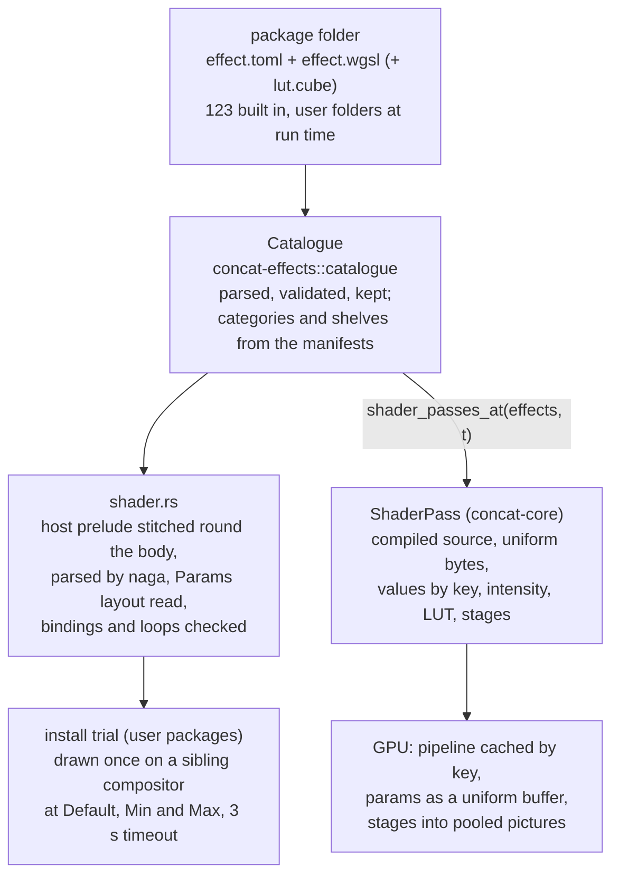

- A shader that binds anything the host did not declare, loops without a
  break, or asks for a look-up table over 65 a side is refused at load.
  A `[[wgsl.pass]]` draws a picture earlier passes cannot read and later
  ones sample through `<target>_at(uv)`; `shrink` lets a blur run at a
  fraction of the layer's pixels. Only the last pass mixes by intensity.
- A shader works in light (`space = "linear"`), in the display encoding
  (`"display"`, colour looks), or in log (`"log"`, ACEScct). A `.cube`
  imported as a look (`looks.rs`) is a format 2 filter reading its table
  through `look()`.
- `[[replaces]]` lets a package stand in for a retired one when a project
  opens, and `Catalogue::add` refuses a user package that claims a
  built-in's id, a bare id, or one already stood in for, with a reason.
- Knobs are numbers; a `wheel` is three (`.x`, `.y`, `.m`), a `curve` up to
  eight points, a `color` is RGBA packed into one. `concat/src/grading.rs`
  and `ui/inspector/grading.slint` draw them.
- Every package draws its own **card** (`concat-host/src/cards.rs`): one
  reference still through the package at its defaults, drawn by the same
  shader and compositor a clip's frames use, kept as a JPEG named by a
  fingerprint of everything it was drawn from.

## 4. Decoding, caching and scheduling

Export decodes every frame once, in order, with one paced decoder per
clip, and does not touch the pool, with one exception: a clip that runs
backwards or on a speed curve is sought frame by frame through
`ReaderPool::frame_at`, which bakes the chain in the same way. Everything
interactive goes through the pool and the one scheduler.

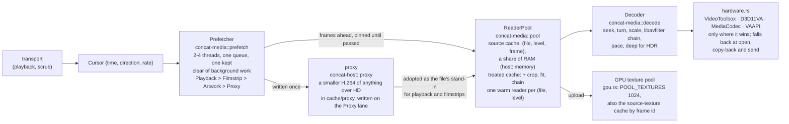

- **The source cache** is keyed by the file, the level it was decoded at
  (the file's own size halved while it still covers what was asked) and
  the frame index, and nothing else. The crop, the fit and the effect
  chain are applied on the way out and kept in a second, smaller cache,
  so turning a knob costs a filter per frame and a scrub back over
  covered ground costs a lookup.
- **The scheduler** is one per process (`concat_host::scheduler()`), and
  owns the pool the monitors read. The frames ahead of the playhead come
  first, then filmstrips, the bin's artwork, then proxies; an import of
  twenty files is twenty jobs on the same few threads, never twenty
  decoders.
- **Hardware decode** is a process-wide preference the window turns on
  at start, asked for stream by stream only where the hardware is faster
  (not for 8-bit H.264). Any failure falls back to software from the last
  delivered frame.
- **The monitor** (`concat-host/src/preview.rs`, `concat/src/panes/
  monitor.rs`) asks for a frame in two calls: `frame_sources` on a worker,
  `texture_of` on the thread that owns the device, so decoded pictures go
  up once and no pixel comes back down. Full quality plays the files
  themselves; Half and Quarter play the proxies.

## 5. Sound

Sound is FFmpeg's in both places, and has exactly one definition of what
speed, fades and gain mean: `concat_media::audio::mix_graph`, a pure
function from audible clips to one filtergraph.

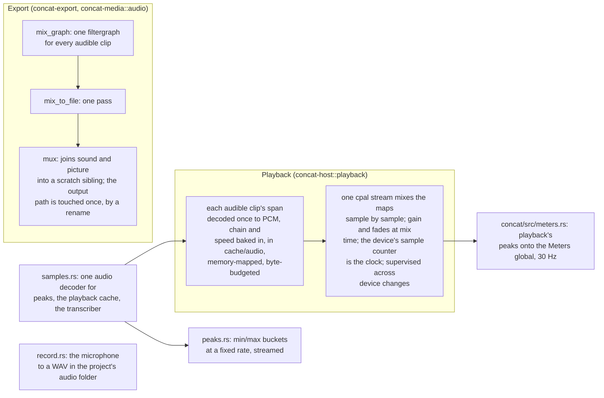

## 6. The window

The window is one Slint tree published from Rust. The controller is
`Studio` (`concat/src/studio.rs`); each pane owns its state and is changed
only by its own messages. Two kinds of state live in `Studio` and the line
between them is the whole design: **the edit** is the engine's, read back
from the open `Session` and written only as `Command`s; **the view**
(selection, playhead, zoom, tool, the dock, locks, what the dialogs show)
is the window's and never reaches the document.

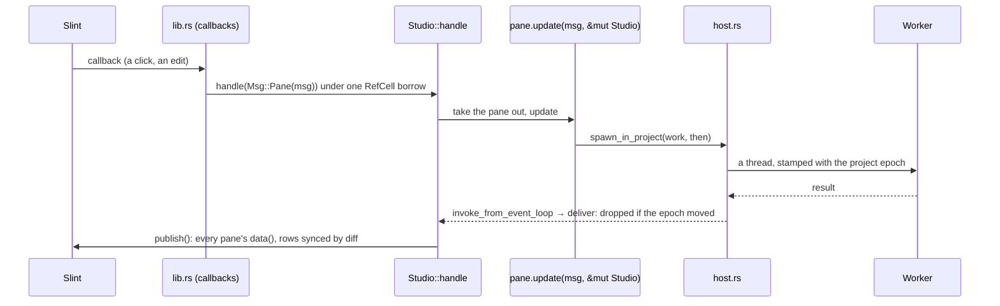

- **Threads.** Slint's models and properties are touched on the
  event-loop thread only, so the state lives in a plain `RefCell` with no
  lock. Everything slow runs through `host::spawn` or
  `host::spawn_in_project` and comes back through
  `slint::invoke_from_event_loop`; a result for a project that has since
  closed is dropped in one place, by epoch. `host::after_dialog` opens a
  native file dialog on its own turn of the loop with nothing borrowed,
  because on macOS a dialog pumps Slint's timers and the transport and
  meter timers borrow the studio too.
- **Panes** (`concat/src/panes/`): captions, export, media bin, monitor,
  project sheet, relink, settings, speech, start, timeline view,
  voiceover. Each is `state + Msg + update + data`.
- **What stays on the controller:** the gestures. A clip dragged,
  trimmed or razored, a picture moved on the stage, a brush stroke: one
  gesture spans the lanes and the stage over an *echo* of the document, a
  clone the pointer mutates and commits as one command on release, so undo
  undoes the drag and not a pixel of it. The clipboard holds a selection
  with each clip's lane row, and a paste lays the group down with its shape
  kept, in this or another timeline, as one undo step (`paste_plan`).
- **Publishing** rebuilds each pane's Slint data on every event; row
  models go through `sync`, which diffs against the last published rows.
  The lanes report their width and the controller publishes only the clips
  that intersect the visible window plus one screen either side. During
  playback `spawn_frame` publishes only the picture.
- **The monitor** draws on the window's own wgpu device
  (`concat/src/gpu.rs`), created before the backend is selected so Slint
  and the compositor share it; a frame is a texture Slint samples with no
  readback. On Android the backend owns its device and none is shared.
- **The dock** (`dock.rs`, `ui/workspace/`) is a tree of splits and
  views walked flat for Slint; the workspace's panes are the monitor, the
  timeline, the library (media, effects, text, stickers), the inspector,
  keyframes, meters and config.
- **Words.** Every string a person reads passes through `i18n::t` or
  `I18n.t` by a dotted key; `en.json` sits under every language; a user's
  `locales/<code>.json` in the config folder lays over a shipped one.
  `fonts.rs` lends the base fonts to Slint and a Noto Sans CJK subset as
  the fallback for Chinese, Japanese and Korean. `presets.rs` makes text
  presets data: TOML folders, built in or the user's own.
- **The launch screen** (`ui/start.slint`) is a rail of verbs beside the
  projects this machine has opened; the new-project form is a sheet at the
  window root. **Preferences** (`prefs.rs`) are one small JSON file: the
  theme, chosen models, languages; nothing about a project.
- **Platform** (`platform.rs`) keeps the differences in one file with the
  reason at each branch: the backend, pickers, the title strip, drops from
  outside (`wayland_drop.rs` listens for the Wayland drop itself), and the
  phone's publish hook.

### 6.1 The phone shell

`ui/phone/` is what the editor is on Android and iOS (`platform::phone`,
or `CONCAT_PHONE=1` on a desk) in place of the title strip and the dock:
a top bar, the monitor, a transport, the lanes with the playhead held at
their middle, and a bar of tools that is the library's pages with nothing
selected and the clip's verbs with one selected. A tool with more to say
opens a sheet over the lanes holding the same inspector page or shelf the
desk shows. `concat-android` is the activity: it points the host's XDG
bases at the app's own folders, forwards the log to logcat, hosts a
headless fragment for the document picker, and publishes a finished
export into the phone's Movies through the media store
(`ConcatFiles.java`).

## 7. The document, undo and the file

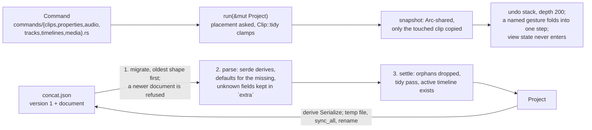

A hand-edited or older file degrades to something openable; nothing short
of a document that is not an object, or has no timeline, fails the load.
`DOCUMENT_VERSION` is 1 and the format is frozen by the documents that
exist: `wire::clip_kind` falls back to `Video` for a kind it does not know,
which is why shapes saved by a newer build vanish in 0.2.5 (section 12).

## 8. The API and the three doors

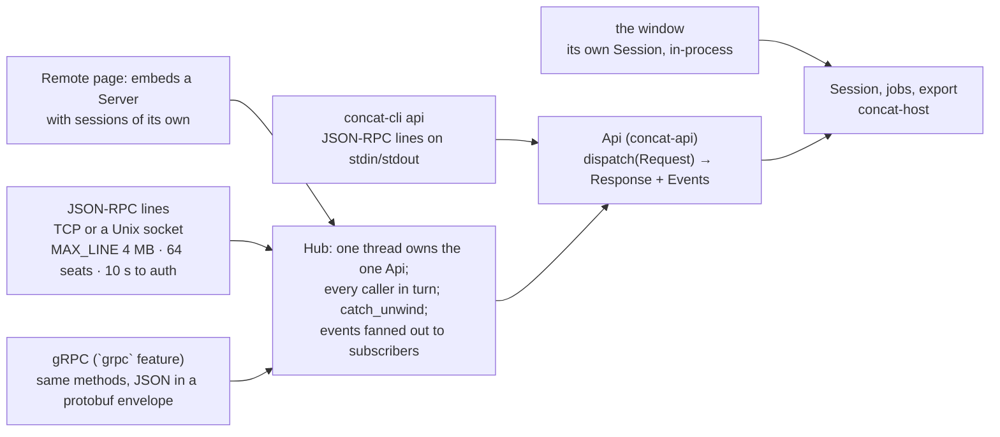

- **The verbs** (`concat-api/src/message.rs`): `project.{create, open,
  close, list, get, save, document}`, `edit.{apply, undo, redo}` carrying
  `concat_project` commands as they are, `media.{probe, import}`,
  `catalogue.list`, `template.{list, save, instantiate}`, `export.run` and
  `export.cancel` as a job with `export.{progress, done, failed}` events,
  `preview.frame`, `cutout.progress`. `version` reports `capabilities`.
- **The door is narrow.** `Server::start` mints a 128-bit token when none
  is configured, loopback included; every connection presents it first and
  the comparison is constant-time (`token.rs`). The API writes only under
  its roots (`Config::roots`, the home folder by default) and bounds a
  frame or an export by `MAX_SIDE`. There is no encryption: a bind off
  loopback belongs behind something that provides it.
- The window is not a client of its own API; what the embedded server and
  the window share is the export slot (one export at a time across them)
  and `concat_api::OpenProjects`, so neither opens a folder the other is
  editing.
- The README names an MCP transport. There is none in the tree; the
  socket transports are JSON-RPC and gRPC, and an MCP server would be a
  third transport over the same `Api`.

## 9. Speech, vision and text

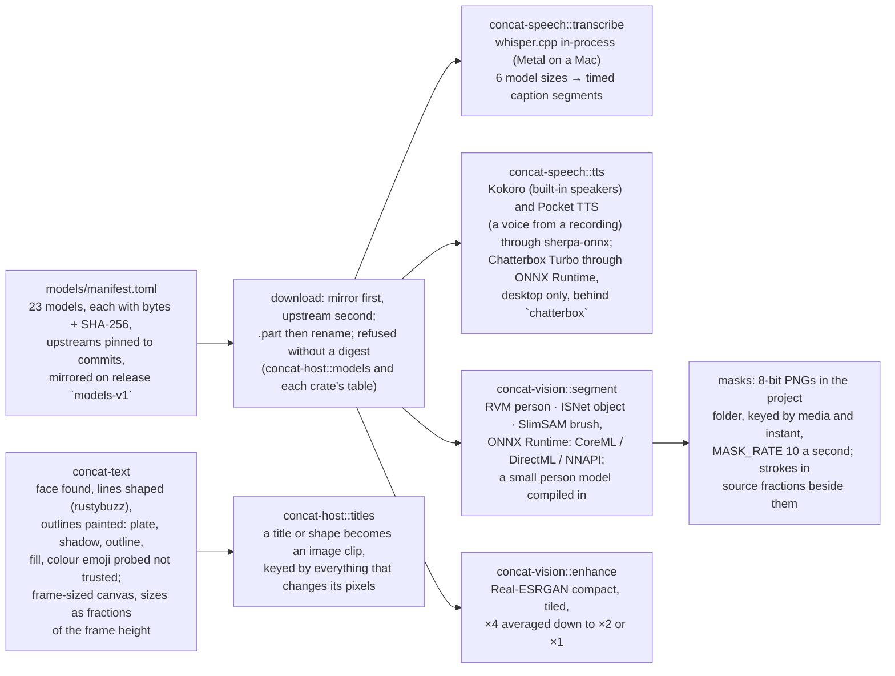

Every long job is one at a time through a `SingleFlight`
(`concat-host/src/jobs.rs`): export, transcription, synthesis, cutout,
brush, enhance, reverse, a model download. `begin` refuses a second run
and every run gets its own cancel flag, so a cancel can only stop the job
that is running.

## 10. Threads and where work runs

| Thread or pool | Owner | What runs there |
|---|---|---|
| The event loop | Slint | every callback, `Studio::handle`, `publish`, drawing the monitor's texture, the transport and meter timers |
| `host::spawn` threads | `concat/src/host.rs` | probes, saves, imports, caption and speech runs, anything a pane starts; results return by epoch |
| The scheduler, 2-4 threads | `concat_host::scheduler()` → `Prefetcher` | frames ahead of the playhead, filmstrips, artwork, proxies; one thread kept clear of the low lanes |
| Playback decode workers (2) and the cpal callback | `concat-host/src/playback.rs` | spans to PCM; the mix |
| The export thread | `concat-host/src/export.rs` → `concat-export::render_on` | the paced decoders, the compositor on its own device, the encoder, the mix, the mux |
| Job threads | `SingleFlight` owners | cutout, brush, enhance, reverse, downloads |
| The cards painter | `concat-host/src/cards.rs` | draws missing effect cards on a thread of its own |
| The Hub thread | `concat-server/src/hub.rs` | the one `Api`; transports are threads that wait on it |
| The recorder thread | `concat-host/src/record.rs` | owns the cpal input stream from open to close |

## 11. On disk

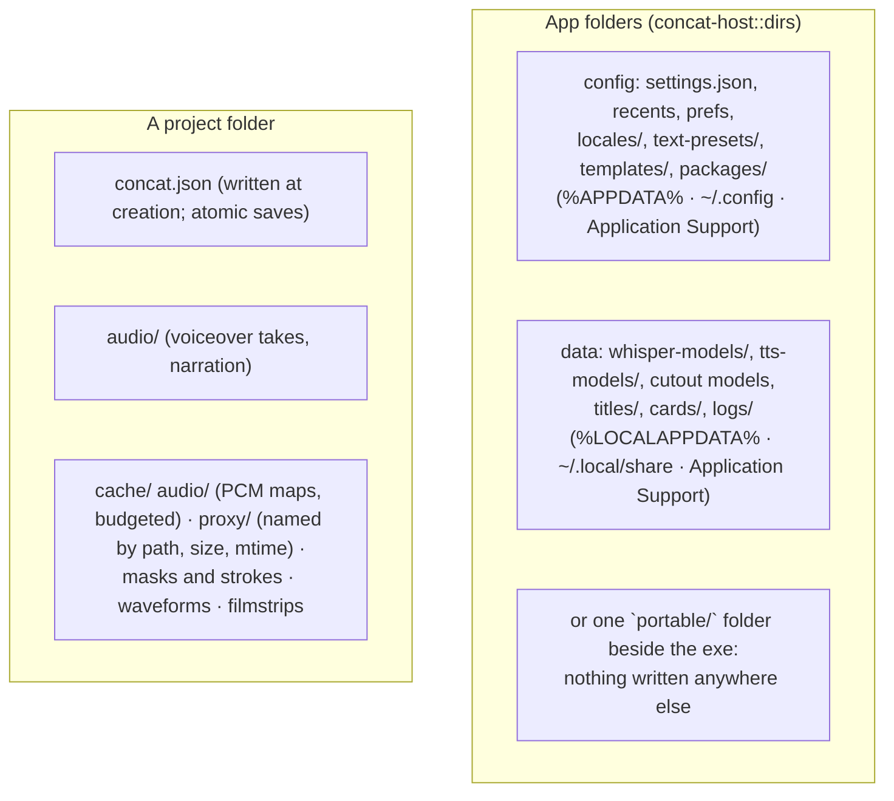

The recents list is the machine's, not the project's, so a folder copied
elsewhere carries no one's history with it. A project is a real thing from
the moment it is created, and `projects::save` is the one code path that
writes `concat.json` (temp file, `sync_all`, rename).

## 12. Build, CI and release

```sh
cd src
cargo dev                               # the window, --profile quick: optimised engine, unoptimised window, incremental
cargo build --profile app -p concat     # the shipping binary: fat LTO, panic=abort, stripped
cargo test --workspace                  # 719 tests; needs FFmpeg's DLLs on PATH on Windows
cargo run -p concat-perf --release -- --check
cargo run -p concat-cli -- serve        # the API on 127.0.0.1:7420
python scripts/locales.py --check       # every locale against the inventory
python scripts/models.py --check        # models/manifest.toml against the engine's tables
```

A build needs FFmpeg 7+ development libraries (`FFMPEG_DIR` on Windows),
cmake and a C++ toolchain for whisper.cpp, and on Linux the fontconfig and
freetype headers for Skia. The window draws with Slint's Skia renderer
from prebuilt binaries; `src/patches/i-slint-renderer-skia` is a vendored
copy of that renderer with one function changed so glyphs sit on whole
pixels at 1x on Windows (#278), and has to be carried across every Slint
upgrade. `flake.nix` builds the window with every native dependency
pinned on Linux.

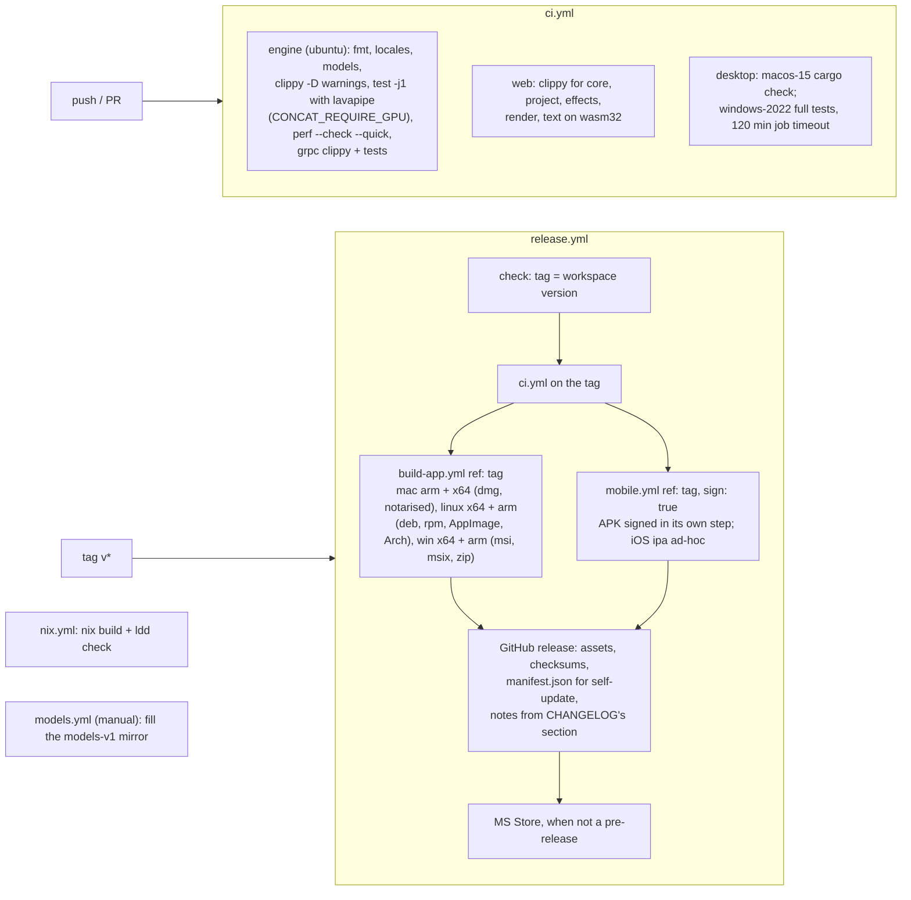

Self-update (`concat-host/src/updates.rs`) reads the release list from
GitHub, the package for this machine from the chosen release's
`manifest.json`, checks the bytes against the manifest's digest, and
hands the package to the platform: the installer on Windows, a copy over
the bundle on macOS, a write over the AppImage, the desktop's installer
for a .deb, .rpm or pacman package. Only releases from 0.2.5 on are
offered. The chain trusts the manifest beside the package and nothing
signs it; see section 13.

## 13. Testing and measuring

| Suite | Where | What it holds |
|---|---|---|
| Unit tests, 719 | every crate but concat-android | the arithmetic, the commands, the placement rule, the reader, the plan, the tolerant document reader |
| Export end to end | `concat-host/tests/export.rs` | every edit a person can make exports through real `Session` commands over synthetic media and is read back, pixels pinned; the rename path with sound |
| Parity | `concat-render/src/gpu/tests.rs` | the GPU against the CPU oracle by SSIM, one plan per feature; runs on lavapipe in CI, skips on WARP unless `CONCAT_REQUIRE_GPU` |
| Hostile packages | `concat-effects/src/shader.rs` tests | the unbounded loop, the extra binding, the oversized table are refused |
| Package fixtures | `fixtures.toml` per package | colours in and out through the shader (`[[probe]]`); chain strings at default, min and max |
| Locales | `concat/src/i18n.rs` tests, `scripts/locales.py` | every shipped locale covers the inventory; the CJK face covers every character the locale files use |
| Performance | `cargo run -p concat-perf --release -- --check` | 22 scenarios, each against a budget: planning, undo, the document, decode, scrub, compositing, export |

What is not measured: the Slint repaint itself (`SLINT_DEBUG_PERFORMANCE`
needs the window), and the window's 23 000 lines of Rust have 73 tests,
the Slint tree none.

## 14. Where to look

| To change | Open |
|---|---|
| what a clip can be | `concat-project/src/model.rs` |
| what an edit does | `concat-project/src/commands/` |
| where a clip may land | `concat-project/src/placement.rs` |
| the file format | `concat-project/src/doc.rs` |
| how a frame is planned | `concat-render/src/plan.rs` |
| how it is drawn | `concat-render/src/gpu.rs`, `compositor.rs` |
| an effect | `concat-effects/packages/<id>/`; the contract in `src/shader.rs` |
| decoding, the cache | `concat-media/src/decode.rs`, `pool.rs`, `prefetch.rs`, `hardware.rs` |
| the sound | `concat-media/src/audio.rs` (export), `concat-host/src/playback.rs` (live) |
| the export loop | `concat-export/src/lib.rs` (`render_on`), `resolve.rs` |
| the monitor | `concat-host/src/preview.rs`, `concat/src/panes/monitor.rs` |
| a sheet or a pane | `concat/src/panes/<name>.rs` and `concat/ui/` |
| the gestures, the clipboard | `concat/src/studio.rs` |
| threads and dialogs in the window | `concat/src/host.rs` |
| a platform difference | `concat/src/platform.rs` |
| the API's verbs | `concat-api/src/message.rs`, `lib.rs` |
| the server | `concat-server/src/lib.rs`, `json.rs`, `grpc.rs`, `token.rs`, `hub.rs` |
| a model's source and digest | `models/manifest.toml`, `concat-host/src/models.rs` |
| a number that matters | `concat-perf/src/main.rs` |
| the release | `.github/workflows/release.yml`, `build-app.yml`, `mobile.yml` |

## 15. Where we stand today

The audits in `audit/` (23 and 28 September, 4, 9 and 11 October) score
every crate and feature and name each finding with a file and a line;
`audit/AUDIT-2026-10-11.md` is the current one and this section is its
one-page shape. Whole-app scores on 11 October: architecture 8, user
likeability 7, code quality 6, design philosophy 6, performance 6, testing
6, documentation 6, maintainability 5, scalability 5, security 4, CI and
release 4.

**What is solid and should stay that way.** The crate boundaries hold:
one compositor, one plan, one placement rule, one definition of sound,
one code path that writes the document, one scheduler. Rational time with
checked rates. Hardware decode that falls back at every stage. Model and
update downloads verified by digest. Atomic saves and, since 9 October,
atomic exports with sound. A document that cannot panic the GPU
(`MAX_SIDE`, `MAX_TIME`, uncaptured-error handlers). Constant-time tokens
and bounded reads on the socket. Every fix of the last fortnight landed
with a test that fails without it.

**What is unfinished or wrong, by layer.**

- *The window.* `studio.rs` is 10 689 lines and one `impl` on a struct of
  about a hundred fields; the gestures, the clipboard and the stage still
  live on the controller, and the panes have moved out one at a time
  (eleven so far). 73 tests cover 23 000 lines of window Rust. Package
  trials, "Relink all", the cache clear and the proxy sweep still run on
  the event-loop thread. About fifteen user-visible strings bypass i18n.
  Two `accessible-*` properties in 29 790 lines of Slint; no keyboard
  reach into dialogs beyond Escape on the confirm sheet.
- *The document.* `DOCUMENT_VERSION` is still 1, so a shape clip written
  by 0.2.6 opens as a video clip in 0.2.5 and the kind is lost on save.
  `SetClipSpeedCurve` can lengthen a clip over its neighbour, the one
  command that bypasses the placement rule. Every undo snapshot clones the
  media bin.
- *The engine.* The export is serial with a readback per frame; the
  mixer scans every clip per sample; pinned prefetch frames sit outside
  the pool's byte budget. The dissolve's hold plays keyed effects early.
  The reader pool caches by `DefaultHasher` names for proxies. HDR side
  data is sized by a Rust mirror of structs FFmpeg says are not ABI.
- *The API and server.* Nine or more window operations have no verb
  (voiceover, meters, the font picker, presets, click-to-preview, copy and
  paste, the overwrite confirmation). Every JSON connection leaks a file
  descriptor; seats are taken before auth; a caller that stops reading
  pins its seat; `Server::stop` blocks the window until a running API
  export ends; API reads are unconfined and caller strings reach FFmpeg's
  opener with no protocol whitelist; gRPC has none of the JSON caps; the
  embedded API opens a second GPU device.
- *Trust.* Self-update trusts the digest beside the package and strips
  quarantine; nothing is signed. FFmpeg, sherpa-onnx and ONNX Runtime are
  fetched in CI from moving releases with no digest; actions are pinned by
  tag; the Windows installers are unsigned and the Mac builds ad-hoc
  signed. Clear cache deletes reversed and enhanced media.
- *CI.* The Windows test job has not passed since 4 October: the hanging
  cards test now skips on WARP, and the job still fails inside `cargo
  test` for a reason the public logs do not show. `scripts/locales.py`
  crashes on a Windows console (cp1252) unless Python runs with `-X utf8`.
- *Phones.* iOS cannot create a project (the default location is a
  Desktop folder the sandbox refuses, #299) and the Choose button is gone;
  Android's export encoders and media-store publishing have not been seen
  on real hardware; the Android bridge has three ways to lose an import.
- *Users are asking for* (open issues, 89): exports that survive an 8 GB
  GPU running out of memory (#297, #223), frame-step buttons and pinch
  zoom on phones, shape masks back (#239), SRT import and export, audio
  ducking, beat detection, a crop tool with free aspect, a command
  palette, a Shortcuts tab (PR #300), an activity panel for long jobs,
  Flatpak, and the Chatterbox DirectML failure (#291).
- *Docs.* `CHANGELOG.md` has no section for the 71 commits since 0.2.6.
  `src/README.md`'s crate table omits concat-text, concat-vision and
  concat-perf. A few comments still describe the CPU compositor fallback
  that no longer exists (`concat-export/src/lib.rs`, `concat-host/
  Cargo.toml`, two sites in `gpu.rs`), and `src/Cargo.toml` says wgpu is
  pinned to Slint 1.17's.

**The order to take it in** is the audit's section 8: the Windows CI job
first, so that a tag can pass its gate; then the server's seats, fds and
`stop`; then the document version for shapes; then the window's thread
hygiene and i18n; then signing. After those, phase 4 of the HDR plan, a
true HDR preview.
